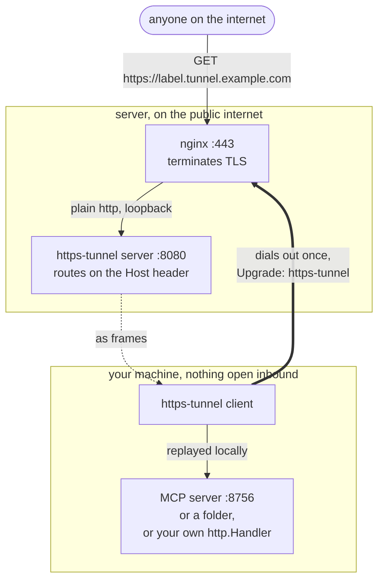

# https-tunnel


Expose a local HTTP port, or a local folder, on a public HTTPS URL. Point it at an MCP server listening on `127.0.0.1:8756`, run the client, and get back something like `https://qr8xfcb946mw.tunnel.example.com` that anyone (or anything) on the internet can call.

One Go binary plays both parts, the way tailscale and headscale split a client and a coordination server but share their plumbing. Which part runs is decided by the config file, not by a separate build. The Next.js web UI and the OpenAPI document are embedded in that same binary, so a deployment is one file plus a config.



The thick line is the only connection anyone dials, and the client is the one that dials it. Public requests travel back down that same socket as frames, so nothing needs to be opened on the local network and the machine can sit behind any amount of NAT.

## Install

Binaries for Linux, Windows and macOS are attached to every release at <https://github.com/chriswirz/https-tunnel/releases>.

Builds are versioned **`v0.1.<build number>`**, where the build number is the CI run zero padded to four digits, so `v0.1.0005`. Every push to the default branch produces a distinct, increasing version that `https-tunnel version` prints back, and the padding keeps them in order however they are sorted: `v0.1.0009` precedes `v0.1.0010`, where `v0.1.9` would sort after `v0.1.10` in anything comparing text. The `0.1` series lives in the `VERSION` file at the root of the repository; a `v*` tag stamps that tag instead.

**`latest` always means the newest commit on the default branch.** Every push publishes a release named after that branch and marks it latest, so `/releases/latest/download/<asset>` is a build of the current tree. A `v*` tag publishes a normal release alongside it, addressable as `/releases/download/v1.2.3/<asset>`, but never takes "latest" away from the branch. Each binary has a matching `.sha256` next to it.

### Windows

```powershell
# 1. Fetch the binary
mkdir C:\Tools\https-tunnel; cd C:\Tools\https-tunnel
# For a pinned version, use .../releases/download/v1.2.3/https-tunnel-windows-amd64.exe
Invoke-WebRequest -Uri https://github.com/chriswirz/https-tunnel/releases/latest/download/https-tunnel-windows-amd64.exe -OutFile https-tunnel.exe

# 2. Write a config to start from, then edit it
.\https-tunnel.exe --example-config > config.json
notepad config.json

# 3. Run it
.\https-tunnel.exe --config config.json client
```

To keep it running in the background, the simplest route is a scheduled task at logon:

```powershell
$exe = "C:\Tools\https-tunnel\https-tunnel.exe"
$cfg = "C:\Tools\https-tunnel\config.json"
$action  = New-ScheduledTaskAction -Execute $exe -Argument "--config `"$cfg`" client" -WorkingDirectory (Split-Path $exe)
$trigger = New-ScheduledTaskTrigger -AtLogOn
Register-ScheduledTask -TaskName "https-tunnel client" -Action $action -Trigger $trigger
```

For a real service that starts before logon, use a wrapper such as [NSSM](https://nssm.cc/) or [WinSW](https://github.com/winsw/winsw); the binary itself is an ordinary console program. Whichever route, the account it runs as needs write access to `config.json`, because the client stores its session id there.

Building from source needs Go 1.25 and Node 20, then `build.cmd` (see [Building](#building)).

### Linux

```bash
# 1. Fetch the binary and check it (use -linux-arm64 on a Pi or a Graviton box).
#    For a pinned version, swap latest/download for download/v1.2.3
base=https://github.com/chriswirz/https-tunnel/releases/latest/download
curl -fsSL -O "$base/https-tunnel-linux-amd64"
curl -fsSL -O "$base/https-tunnel-linux-amd64.sha256"
sha256sum -c https-tunnel-linux-amd64.sha256
sudo install -m 0755 https-tunnel-linux-amd64 /usr/local/bin/https-tunnel

# 2. A service account and somewhere to live
sudo useradd --system --no-create-home --shell /usr/sbin/nologin https-tunnel
sudo install -d -o https-tunnel -g https-tunnel /etc/https-tunnel /var/lib/https-tunnel

# 3. A config to start from
https-tunnel --example-config | sudo tee /etc/https-tunnel/config.json >/dev/null
sudo chown https-tunnel:https-tunnel /etc/https-tunnel/config.json
sudo chmod 600 /etc/https-tunnel/config.json
sudo $EDITOR /etc/https-tunnel/config.json

# 4. Run it under systemd
sudo install -m 0644 deploy/https-tunnel.service /etc/systemd/system/
sudo systemctl daemon-reload
sudo systemctl enable --now https-tunnel
journalctl -u https-tunnel -f
```

`deploy/https-tunnel.service` runs the server and `deploy/https-tunnel-client.service` runs the client; the client unit's header comments also cover installing it as a per user service with no root at all. Both are hardened (`ProtectSystem=strict`, no capabilities, a syscall filter) and both keep `/etc/https-tunnel` writable, because the client persists its session id and the server persists the admin password hash there.

For the public side, put nginx in front: see [Deployment](#deployment).

## Quick start

```bash
https-tunnel --example-config > config.json
```

Client side, edit the `client` section:

```json
{
  "client": {
    "api_key": "the key the server admin gave you",
    "server_url": "https://tunnel.example.com",
    "session_id": "",
    "local_port": 8756
  }
}
```

```bash
https-tunnel --config config.json client

  https://qr8xfcb946mw.tunnel.example.com  ->  http://127.0.0.1:8756
  session: 6wjulksypp3hbptpm5hqbn2davqbroyn
```

The issued session id is written back into the config file, so the next run reclaims the same URL. Delete it to get a fresh one.

Server side, set `server.enabled` to true, fill in `base_domain` and `api_keys`, then:

```bash
https-tunnel --config config.json server
```

With no subcommand, every enabled section runs, which is the easiest way to try the whole thing on one machine.

## Serving a folder instead of a port

Set `local_dir` and leave out `local_port`, and the client serves that folder itself. No local web server is involved: requests are answered inside the client process, straight from the disk.

Both may be configured at once. The port takes precedence, so a folder can stay in the file as a standing fallback while a local server is running, and removing `local_port` switches to serving it. The client logs which of the two it is using at startup.

```json
{
  "client": {
    "api_key": "...",
    "server_url": "https://tunnel.example.com",
    "local_dir": "/srv/handbook",
    "cache_mb": 64,
    "directory_listing": false
  }
}
```

`cache_mb` sizes an in-memory LRU that keeps frequently requested files hot; 0 turns it off and reads every request from the disk. Entries are validated against the file's size and modification time on every hit, so editing a file serves the new version immediately, and no single file may take more than an eighth of the budget, so one large asset cannot flush the working set. Responses carry `X-Cache: hit`, `miss` or `bypass` (the last for files too big to cache, which stream from disk). Range requests, conditional requests and content type detection all come from the standard library, and the served paths cannot escape the folder: `..` and symlinks pointing outside it are refused. A directory with an `index.html` serves it; without one the request is refused unless `directory_listing` is on. Only GET and HEAD are accepted.

## Docker

The compose examples live in [`examples/docker/`](examples/docker/), one directory each, using an inline Dockerfile so there is nothing to copy but a single file:

| | |
| --- | --- |
| [`expose-a-service`](examples/docker/expose-a-service/compose.yaml) | the client side: publish a containerised HTTP service on a public URL, with nothing listening on the host |
| [`tunnel-server`](examples/docker/tunnel-server/compose.yaml) | the server side: the tunnel server sharing a container with the nginx that fronts it, so nginx reaches it over loopback |
| [`tunnel-server-debian`](examples/docker/tunnel-server-debian/compose.yaml) | the same, built on `nginx:latest` rather than alpine, with the apt and dash differences spelled out |

```bash
cd examples/docker/expose-a-service
echo 'TUNNEL_API_KEY=the-key-your-admin-gave-you' > .env
docker compose up -d
docker compose logs tunnel     # prints the public URL
```

[`examples/docker/README.md`](examples/docker/README.md) covers what each one is doing, including the parts worth copying: the client's `local_host` is the *service name* rather than `127.0.0.1`, and its config belongs on a volume because the session id is written back into it.

## Asking for a specific subdomain

By default a session gets a random label. Set `subdomain_request` in the client section to ask for a particular one:

```json
"subdomain_request": "my-domain"
```

Against a server at `https://tunnel.example.com` that asks for `https://my-domain.tunnel.example.com/`. The request is granted when that label is free, and also when another session of the same API key already holds it, which is that key reclaiming its own name after losing its session id; the older session is replaced.

If a session belonging to a **different** API key holds the label, or the name is reserved (`www`, `api`, `admin`, `mail`, `ns1`, `ns2`, `static`, `assets`, `cdn`, `localhost`), the request is refused quietly and a random label is issued exactly as if nothing had been asked for. The server logs the substitution, and the client prints the URL it actually got, so read that rather than assuming the request was met. The value is lowercased and stripped to a legal DNS label first, so `Domain!!` is treated as `domain`.

An API key may also pin a label server side, with `"subdomain": "workstation"` in its `api_keys` entry. That overrides whatever the client asks for, and is the way to guarantee a stable name for a particular client.

## Embedding the client in your own program

The client is a library as well as a command. An application that already serves HTTP can open its own tunnel, with no second process to install, supervise or keep in step:

```bash
go get github.com/chriswirz/https-tunnel/tunnelclient
```

```go
tc, err := tunnelclient.New(tunnelclient.Options{
    APIKey:    os.Getenv("TUNNEL_API_KEY"),
    ServerURL: "https://tunnel.example.com",
    Handler:   myMCPServer, // any http.Handler
    OnConnect: func(t tunnelclient.Tunnel) { log.Printf("public url: %s", t.URL) },
    OnSession: func(id string) error { return saveSessionID(id) },
})
if err != nil {
    return err
}
go tc.Run(ctx) // reconnects on its own until ctx is canceled
```

With `Handler` set, tunneled requests are served in process and never touch a local socket, so nothing has to listen on a port at all. The alternatives are `TargetURL`, to proxy to a server already listening locally, and `Dir`, to serve a folder with the same LRU cache the command uses. Exactly one of the three is expected.

`Options` also carries `SessionID` and `SubdomainRequest` for a stable URL, `Logger` for a `*slog.Logger` of your own, and `ClientInfo` for a line in the server's log. `Run` blocks and reconnects with backoff; `Tunnel()` reports the live URL and session at any time; `OnConnect` fires on every reconnect, not just the first.

Three complete programs live in `examples/`:

| | |
| --- | --- |
| `embedded-mcp` | an application serving its own `http.Handler` through a tunnel, standing in for an MCP server, with a JSON-RPC endpoint and a server-sent-event stream |
| `embedded-dir` | a program publishing a folder, with `-listing`, `-cache-mb`, `-subdomain` and a `-session-file` that keeps the URL across restarts |
| `upload-download` | a password protected file drop: sign in with `-password`, then upload, download and delete files over the tunnel. The pages, stylesheet, script and favicon are embedded in the binary with `go:embed`, so the only thing on disk is `-dir` |

```bash
go run ./examples/embedded-dir -server https://tunnel.example.com -key "$TUNNEL_API_KEY" -dir ./public -listing
go run ./examples/upload-download -server https://tunnel.example.com -key "$TUNNEL_API_KEY" -password hunter2 -dir ./drop
```

All three are compiled by `./build.sh` and `build.cmd`, and by CI on every platform, so a change to the library API cannot quietly break them. The release attaches them next to the main binary. Nothing is written to stdout by the library itself, so a program that speaks a protocol on stdout stays clean.

## Signing in to the web UI

The server's own hostname serves a web UI. On a fresh install it has no password, and the first sign in is **admin / admin**; the UI then refuses to show anything until a new password is set. That password is hashed with PBKDF2-HMAC-SHA256 (600k iterations, per-password salt) and written back into `server.admin.password_hash` in the config file, so the plaintext is never stored.

The account can be renamed at the same time, or later from the **account** page: `admin` becomes `crwirz`, and from that moment nothing signs in as `admin` again. There is one administrator account, so renaming retires the old name rather than adding a second one, and the first boot path checks the configured name too, which is why clearing `password_hash` later brings back `crwirz` with the default password and never `admin`.

Afterwards, sign in with the chosen name and password. To reset a forgotten password, clear `password_hash` in the config file and restart: the server is back to first boot for whatever the account is called now. Browser sessions live in memory, so a restart signs everyone out, and so does any change to the account.

The API key and the admin login are separate credentials for separate jobs: tunnel clients present an API key, browsers sign in. Either is accepted on the session read and delete endpoints; only an API key can open a tunnel.

Once signed in, the admin can revoke any session from the UI: there is a revoke button on every row of the overview and the sessions list, and on the session's own page. Revoking frees the subdomain and drops the tunnel; a client that is still running reconnects and is issued a new session on a new URL, so it is a way to cut a tunnel off, not to stop a client permanently. To do that, remove its API key from the config and restart.

The sessions page also has a **clean up** control for the accumulated dead ones: pick an idle window (5m, 30m, 1h, 6h, 24h, 2d, 1w, 1m) and it deletes every **disconnected** session with no activity since. Connected tunnels are never touched, however quiet they have been, because a quiet tunnel still has a client on the end of it. The button names the count before you confirm, and the dialog lists the subdomains going away.

## Configuration

`config.json` has exactly two sections. `//` line comments are stripped before parsing, so the file can be annotated. `https-tunnel --example-config` prints a fully annotated one, and `--config <path>` runs against any file (`config1.json`, `client.json`, and so on).

| client | |
| --- | --- |
| `api_key` | credential presented to the server |
| `server_url` | control plane, e.g. `https://tunnel.example.com` |
| `session_id` | written back on first connect; keeps the URL stable |
| `local_port` / `local_host` / `local_scheme` | the local server to expose |
| `local_dir` | a folder to serve when `local_port` is absent; the port wins if both are set |
| `cache_mb` | LRU file cache for `local_dir`, in megabytes; 0 disables it |
| `directory_listing` | list a folder that has no `index.html` |
| `subdomain_request` | ask for a specific label, e.g. `chris`; falls back to a random one if taken |

| server | |
| --- | --- |
| `port` / `addr` | listener, typically `127.0.0.1:8080` behind nginx |
| `base_domain` | control plane host; tunnels are `<label>.<base_domain>` |
| `public_scheme` | fallback scheme for issued URLs; the request's own scheme wins |
| `api_keys` | accepted credentials; a key may pin a fixed `subdomain` |
| `admin` | web UI account: `username` and `password_hash`, both written by the server when they are changed, plus `session_hours` |
| `state_file` | where session identities persist across restarts |
| `session_ttl_hours` | expire idle disconnected sessions; 0 keeps them |
| `tls.cert_file` / `tls.key_file` | serve HTTPS directly instead of behind nginx |
| `trust_forwarded_headers` | gonor `X-Forwarded-*` from a trusted front proxy |

Both roles can be enabled at once; `https-tunnel client` and `https-tunnel server` restrict a run to one of them.

### Serving HTTPS without nginx

Set both TLS paths and the server terminates TLS itself on its configured port. Because every tunnel gets its own subdomain, the certificate has to cover the wildcard as well as the apex:

```json
"tls": {
  "cert_file": "/etc/letsencrypt/live/tunnel.example.com/fullchain.pem",
  "key_file": "/etc/letsencrypt/live/tunnel.example.com/privkey.pem"
}
```

Both files must be **PEM**, the text format beginning `-----BEGIN ...`. The extension is not checked and carries no meaning: `.pem`, `.crt`, `.cer`, `.key`, even `.txt`, all load as long as the contents are PEM. Binary DER (`.der`, and confusingly some `.cer`) and PKCS#12 (`.pfx`, `.p12`) do not load, and the server exits at startup with `tls: failed to find any PEM data in certificate input`. Convert first:

```bash
openssl x509 -in cert.der -inform DER -out cert.pem          # DER  -> PEM
openssl pkcs12 -in cert.pfx -clcerts -nokeys -out fullchain.pem   # PFX -> cert
openssl pkcs12 -in cert.pfx -nocerts  -nodes  -out privkey.pem    # PFX -> key
openssl rsa -in encrypted.key -out privkey.pem               # remove a passphrase
```

`cert_file` is the full chain, leaf certificate first followed by any intermediates in the same file; serving the leaf alone fails verification in some clients. `key_file` is the matching private key in PKCS#8 (`BEGIN PRIVATE KEY`), PKCS#1 (`BEGIN RSA PRIVATE KEY`) or SEC1 (`BEGIN EC PRIVATE KEY`) form. Passphrase protected keys are not supported, because nothing would be there to type the passphrase at boot.

Leave both empty for the usual deployment, where nginx holds the certificate and forwards plain HTTP to loopback.

## Deployment

The repository ships a complete site file at **`nginx/tunnel.example.com.conf`**, named after the hostname it configures. Install it, then swap in your own domain wherever the example one appears:

```bash
sudo cp nginx/tunnel.example.com.conf /etc/nginx/sites-available/tunnel.example.com.conf
sudo sed -i 's/tunnel\.example\.com/your.domain.here/g' /etc/nginx/sites-available/tunnel.example.com.conf

sudo ln -s /etc/nginx/sites-available/tunnel.example.com.conf /etc/nginx/sites-enabled/
sudo nginx -t && sudo systemctl reload nginx
```

That one `sed` catches every place the file names a host: both `server_name` directives, the certificate paths under `/etc/letsencrypt/live/`, and the DNS and certbot notes in the header comments. The access and error logs are named after the application rather than the site, so they need no change. Rename the file to match your hostname if you like, and set `base_domain` in `config.json` to the same value.

It deliberately uses two `server` blocks rather than one. The apex gets the control plane rules: rate limiting on `/api/v1/connect`, a health check location, a day long timeout on the tunnel handshake. The wildcard gets a single catch-all location with upgrade passthrough, buffering disabled and hour long timeouts. Sharing one block would apply those apex path rules to every tunnel, so a tunneled server that happened to expose `/api/v1/connect` or `/healthz` would be rate limited and would lose the upgrade headers and long timeouts its own traffic needs. nginx prefers an exact `server_name` over a wildcard, so the split routes each host correctly.

It needs two DNS records pointing at the host, the apex and the wildcard, and a wildcard certificate, which means a DNS-01 challenge:

```bash
certbot certonly --dns-cloudflare \
  -d tunnel.example.com -d '*.tunnel.example.com'
```

## Control plane API

The base domain is the control plane and nothing else; every `<label>.<base domain>` is a tunnel and serves only what its client is running. None of these paths exist on a tunnel hostname.

Tunnel clients authenticate with `Authorization: Bearer <api key>` (or `X-API-Key`). Browsers authenticate with the session cookie from `/api/v1/auth/login`. `/healthz`, the spec, and the auth endpoints themselves are open.

```
POST   /api/v1/connect        {"session_id": "optional"} -> {"session": "...", "url": "https://..."}
GET    /api/v1/tunnel         upgrade to the tunnel protocol, with X-Tunnel-Session
GET    /api/v1/sessions       list every session
GET    /api/v1/sessions/{id}  fetch one session
DELETE /api/v1/sessions/{id}  delete a session and disconnect its client
DELETE /api/v1/sessions       delete every disconnected session idle for at least ?idle_for=24h
GET    /api/v1/auth/session   report the current sign in state
POST   /api/v1/auth/login     sign in as the administrator
POST   /api/v1/auth/logout    drop the session
POST   /api/v1/auth/account   change the administrator username, password, or both
GET    /healthz
GET    /openapi.json          this API as OpenAPI 3.1
```

The specification lives at `internal/server/openapi.json`, is served from `/openapi.json` (also `/api/v1/openapi.json`), and is rendered by the UI at `/swagger`, which can call the endpoints once you are signed in. `npm run codegen` in `web/` generates a typed TypeScript client from that same document.

## How the tunnel works

The client calls `/api/v1/connect` to get (or resume) a session, then opens `/api/v1/tunnel` with an HTTP/1.1 upgrade to `https-tunnel`. The server answers `101` and hijacks the connection. Using an upgrade rather than a bespoke port is what lets nginx forward the connection untouched, exactly as it does for websockets.

After that both sides speak a binary frame protocol: a one byte type, an eight byte stream id, a four byte length, then the payload. Each public request gets its own stream id, so requests and responses interleave freely on the single socket. Bodies are streamed in both directions and flushed chunk by chunk, so server-sent events and other streaming transports work unbuffered. The server pings every 30 seconds; a client that loses the tunnel reconnects with exponential backoff and, because it kept its session id, comes back on the same URL.

## Building

Go 1.25 and Node 20. The Go binary embeds `web/out`, so the frontend is built first.

```bash
./build.sh          # frontend, gofmt, vet, tests, then ./https-tunnel
./build.sh smoke    # run a client and server against each other on loopback
./build.sh dev      # Go server on 8080, next dev on 3000 with hot reload
./build.sh cross    # every release binary into dist/
./build.sh examples # the example programs into dist/examples/
```

`build.cmd` is the Windows equivalent with the same targets. By hand it is just:

```bash
cd web && npm ci && npm run build && cd ..   # produces web/out
go build -o https-tunnel .
```

A local build stamps `v0.1.0-dev+<short sha>` rather than a build number, because there is no CI run behind it, so `https-tunnel version` says plainly where a binary came from.

A checkout that has never run the frontend build still compiles: `web/out` holds a `.gitkeep` so the `go:embed` resolves, and the server logs a warning and serves the API alone.

## Layout

```
VERSION                  the version series, v<this>.<build number>, bumped by hand
main.go                  cli entry point, embeds web/out, runs the enabled sections
internal/config          config loading, validation, session id and password writeback
internal/tunnel          frame protocol shared by both sides
tunnelclient/            the client as an importable library, for embedding in your own program
internal/server          control plane, admin auth, session manager, host based reverse proxy
internal/server/openapi.json  the API contract, embedded and served
web/                     Next.js app (App Router, MUI), statically exported into web/out
tools/mkicon             regenerates the web icons from appicon.png
examples/                embedded-mcp, embedded-dir and upload-download use the library; docker/ holds compose stacks
deploy/                  systemd units for the server and the client
nginx/                   site file for the public hostname
.github/workflows        build, test, smoke test and release
```

## Continuous integration

`.github/workflows/build.yml` builds the frontend once, runs gofmt, vet and the race-enabled tests, which include parsing the OpenAPI document and resolving every reference in it, cross compiles for linux/amd64, linux/arm64, windows/amd64 and both macOS architectures, then boots the linux binary and drives a real tunnel, the web UI and the admin login before anything is published. Pull requests stop there with the binaries attached as artifacts. Pushes to the default branch, `main` or `master` (both are wired up), also update a rolling prerelease named after that branch, and a `v*` tag publishes a normal release with generated notes, stamped with the tag rather than a build number. The branch build is the one marked `make_latest: true`, so `/releases/latest/download/...` is always a build of the newest commit; a tag published afterwards does not take that over, because tag releases set `make_latest: false`.

## Security notes

- The tunnel itself is protected by TLS to the server plus the API key on both the connect and the upgrade request; there is no second layer inside the frame protocol. An `http://` `server_url` therefore sends the key, and all tunneled traffic, in the clear, and the client warns when it sees one outside loopback.
- API keys are compared in constant time, and a session can only be resumed by the key that created it.
- The administrator password is stored only as a PBKDF2-HMAC-SHA256 hash. A first boot session, admitted with the default password, can do nothing except set a real one.
- There is a single administrator account and renaming it is final: the previous name cannot sign in, cannot be given a new password, and does not come back if the hash is cleared. Usernames are compared lowercased and trimmed, so case is never what decides a login.
- Subdomain labels are drawn from an alphabet without vowels or look-alike characters, so a random URL is neither guessable nor easy to mistype.
- The URL is the only thing protecting a tunneled server from the public internet. Anything reachable there should do its own authentication; the proxy adds none.
- A served folder is exposed in full to anyone with the URL. Directory listing is off by default and paths cannot escape the root, but the files themselves are public.
- Enable `trust_forwarded_headers` only when a trusted proxy is actually in front, otherwise clients can spoof their own address. It is also what lets the server report `https://` URLs while listening on plain HTTP behind nginx, since that is read from `X-Forwarded-Proto`.
